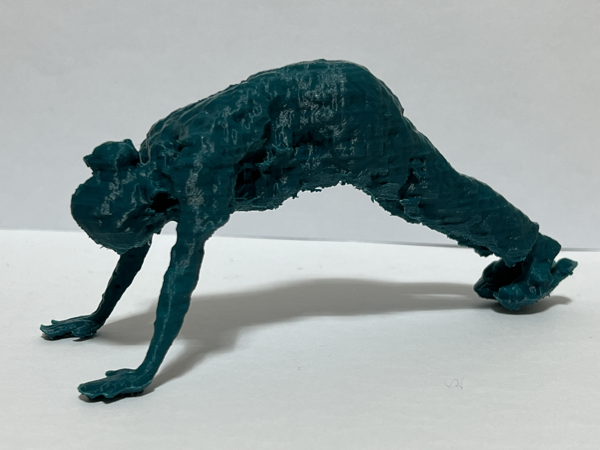

<br>

<div align="center">

<!-- ALL-CONTRIBUTORS-BADGE:START - Do not remove or modify this section -->
[](#contributors-)
<!-- ALL-CONTRIBUTORS-BADGE:END -->
[](https://hits.seeyoufarm.com) 

</div>

<br>

# 플랭크 현동 3D
헬스보이 현동이가 알려주는 정확한 플랭크 자세!\
헬창이 되고 싶은 사람들은 **NeRF모델을 이용해 뽑은, 현동이 피규어**를 요리조리 살펴보고 자신과 비교하며 운동해보는건 어떨까? 🏋🏻

<br/>

## 최종 결과물
<p align="center"></p>
본 피규어는 <a href="https://github.com/ProtossDragoon/PlankHyundong/blob/docs/docs/GUIDELINE.md#evaluation">정성평가</a>를 진행해 얻은 결과물입니다.

# 목차

- [빠른 시작](#quickstart)
- [구성요소별로 시작하기](#start)
    - [1️⃣ 피사체 동영상 촬영하기](#step1)
    - [2️⃣ 비디오로부터 이미지 샘플링하기](#step2)
    - [3️⃣ 이미지에 대한 카메라 포즈 구하기](#step3)
    - [4️⃣ NeRF 모델 학습시키기](#step4)
    - [5️⃣ NeRF 모델로부터 Mesh 만들고 다듬기](#step5)
    - [6️⃣ 피규어 인쇄하기](#step6)
- [환경](#env)
- [팀](#team)

<br/>

<a name="quickstart"></a>
# 빠른 시작

<p style="text-align:center;">
<a href="https://colab.research.google.com/github.com/yyongjae/PlankHyundong/blob/main/nerf_quick_start.ipynb">
  
</a></p>


**notebook** 폴더에 있는 여러 기능의 노트북들을 한번에 실행할 수 있게 **nerf_quick_start.ipynb** 노트북을 만들었다.
총 4단계로 이루어져 있으며 구성은 다음과 같다.<br>

- [1️⃣ Video Sampling : 비디오로부터 이미지 샘플링하기](#step1)
- [2️⃣ Run COLMAP to get camera pose : 이미지에 대한 카메라 포즈 구하기](#step2)
- [3️⃣ Run NeRF : NeRF 모델 학습시키기](#step3)
- [4️⃣ Get Mesh file : NeRF 모델로부터 Mesh 만들고 다듬기](#step4)

필요한 데이터는 `data/video/video.MOV`의 경로에 있다.
해당 데이터로 샘플링을 진행하고 카메라 포즈를 구한다.

노트북을 실행시키기에 앞서 본인의 코랩 환경에 맞게 파일 경로를 설정 해주어야 한다.
```
# Set your Google Drive path to our repository
path = 'content/PlankHyundong'

video_path = f'{path}/data/video/video.MOV'
img_path = f'{path}/data/images'
logs_path = f'{path}/data/logs'
```

시작 위치에 있는 해당 셀에서 `path` 변수의 경로를 환경에 맞게 수정해주면 된다.
`data/images` 폴더에는 샘플링한 이미지들이 저장되고, `data/logs` 폴더에는 config.txt, mesh.obj, weight 및 영상 파일 등이 저장된다.

그렇기 때문에 해당 노트북과 더불어 

<a name="start"></a>
# 구성요소별로 시작하기

- 1️⃣ RGB Video: 피사체를 가운데에 두고 촬영자는 360도로 회전하며 영상을 수집한다.
- 2️⃣ N*RGB image: 영상을 샘플링하여 이미지들을 얻는다.
- 3️⃣ N*camera pose: 카메라 포즈는 NeRF 학습에 필요한 것으로, 이전 단계의 샘플링된 이미지로부터 LLFF를 수행함으로써 얻을 수 있다.
- 4️⃣ implicit 3D representation: NeRF 모델을 학습시켜 결과물을 얻어낸다.
- 5️⃣ 3D representation: implicit 3D representation을 시각화하기 위해 Mesh(.obj)를 생성한다.
- 6️⃣ slicer SW: 3D 프린터로 뽑기 전에 슬라이서에서 최적의 파라미터를 세팅한다.
- 6️⃣ figure: 3D 프린터로 최종 결과물을 뽑아낸다.

구체적인 내용은 아래에서 확인할 수 있다.

<br/>

<a name="step1"></a>
## 1️⃣ 피사체 동영상 촬영하기
`TODO`: images 파일에 올리고 연결해줘야 함
<table>
<thead align="center">
  <tr>
    <th>권장, 360도 촬영</th>
  </tr>
</thead>
<tbody align="center">
  <tr>
    <td></td>
  </tr>
  <tr>
    <td>이 프로젝트에서 촬영한 방법</td>
  </tr>
</tbody>
</table>

➕ 촬영 권장사항과 주의사항은 <a href="https://github.com/ProtossDragoon/PlankHyundong/blob/docs/docs/GUIDELINE.md#step1">다음</a>을 확인해주세요!

<a name="step2"></a>
## 2️⃣ 비디오로부터 이미지 샘플링하기
`TODO`: images 파일에 올리고 연결해줘야 함
<p style="text-align:center;">
<a href="https://colab.research.google.com/github/ProtossDragoon/PlankHyundong/blob/main/notebooks/sampling_colab.ipynb">
  
</a></p>

<p align="center"></p>

스크립트를 이용하여 촬영한 비디오를 이미지로 등간격 샘플링합니다.

- ✅ 카메라 트래젝토리가 길다면 더 잘게 잘라 주는 것이 좋습니다.
- ❗ 카메라 트래젝토리가 짧고 렌즈를 열어두는 시간이 짧은 경우, 동영상으로부터 이미지를 너무 잘게 샘플링한다면 성능에 악영향을 미칠 수 있습니다.

➕ 자세한 파라미터는 <a href="https://github.com/ProtossDragoon/PlankHyundong/blob/docs/docs/GUIDELINE.md#step2">다음</a>을 확인해주세요!

<a name="step3"></a>
## 3️⃣ 이미지에 대한 카메라 포즈 구하기
`TODO`: 이미지 추가 및 images 파일에 올리고 연결해줘야 함

<p style="text-align:center;">
<a href="https://colab.research.google.com/github/ProtossDragoon/PlankHyundong/blob/main/notebooks/colmap_colab.ipynb">
  
</a></p>

**NOTE:** 반드시 GPU 런타임을 사용해야 합니다.

NeRF 의 입력은 (이미지, 카메라포즈) 의 집합입니다. 커스텀 이미지로부터 이미지 각각에 해당하는 카메라 포즈를 계산하기 위해 [COLMAP](https://github.com/colmap/colmap)을 기반으로 동작하는 [LLFF](https://github.com/Fyusion/LLFF) 저자의 스크립트를 사용합니다. 

<p align="center"></p>

실행이 완료되면 데이터셋 폴더 안에 NeRF 모델을 실행시키는 데 필요한 `poses_bounds.npy` 파일이 생성됩니다.

➕ LLFF 환경 구축에 어려움이 생기면 <a href="https://github.com/ProtossDragoon/PlankHyundong/blob/docs/docs/GUIDELINE.md#step3">다음</a>을 확인해주세요!

<a name="step4"></a>
## 4️⃣ NeRF 모델 학습시키기

<p style="text-align:center;">
<a href="https://colab.research.google.com/github/ProtossDragoon/PlankHyundong/blob/main/notebooks/nerf_wandb_colab.ipynb">
  
</a></p>

**NOTE:** 반드시 GPU 런타임을 사용해야 합니다.

### 학습 옵션

|       옵션      | 역할 |
|:---------------:|:---:|
| `--no_ndc`, `--spherify`, `--lindisp` | forward facing scene 에서는 필요하지 않지만, 360 scene 에 대해서는 반드시 사용해야 하는 플래그입니다.|

### 결과
<table>
<thead align="center">
  <tr>
    <th>RGB</th>
    <th>RGB_still</th>
    <th>disparity</th>
  </tr>
</thead>
<tbody align="center">
  <tr>
    <td></td>
    <td></td>
      <td></td>
  </tr>
</tbody>
</table>

➕ wandb 연동과 nerf 파라미터 실험 결과를 알고 싶다면 <a href="https://github.com/ProtossDragoon/PlankHyundong/blob/docs/docs/GUIDELINE.md#step4">다음</a>을 확인해주세요!

<a name="step5"></a>
## 5️⃣ NeRF 모델로부터 Mesh 만들고 다듬기

### Mesh 만들기

<p style="text-align:center;">
<a href="https://colab.research.google.com/github/ProtossDragoon/PlankHyundong/blob/main/notebooks/extract_mesh_colab.ipynb">
  
</a></p>

**NOTE:** 반드시 GPU 런타임을 사용해야 합니다.

NeRF 모델로 학습시킨 학습시킨 모델을 로드한 뒤, `PyMCubes` 패키지를 통해 표면(iso-surface)을 추출하고 그 결과물인 `3d.obj` 파일을  저장하는 단계입니다. 이 노트북의 출처는 [NeRF 공식 저장소](https://github.com/bmild/nerf/blob/master/extract_mesh.ipynb)입니다.
 
- 위 노트북에서는 학습된 NeRF 모델의 3D 표현(implicit representation)을 시각화 하기 위해 `pyrender` 을 이용해 `turntable.mp4` 영상을 생성합니다.

<p align="center"></p>

### Mesh 다듬기
<p align="center"></p>

데이터를 직접 수집하였기 때문에 추출한 mesh에 노이즈가 많아, 3d 프린터로 출력 전 blender로 직접 노이즈를 제거해주었다.


➕ mesh renderer 파라미터 실험 결과와 데이터에 따른 mesh 다듬기 유의사항을 알고 싶다면, <a href="https://github.com/ProtossDragoon/PlankHyundong/blob/docs/docs/GUIDELINE.md#step5">다음</a>을 확인해주세요!

<br>

<a name="step6"></a>
## 6️⃣ 피규어 인쇄하기
<table>
<thead align="center">
  <tr>
    <th>슬라이서 소프트웨어</th>
    <th>출력 중인 모습</th>
  </tr>
</thead>
<tbody align="center">
  <tr>
    <td></td>
    <td></td>
  </tr>
</tbody>
</table>

### 인쇄된 피규어 후가공하기
<table>
<thead align="center">
  <tr>
    <th></th>
    <th>before</th>
    <th>after</th>
  </tr>
</thead>
<tbody align="center">
  <tr>
    <td>라프트 제거</td>
    <td></td>
    <td></td>
  </tr>
</tbody>
</table>

➕ 3D 프린터 옵션 실험 결과를 알고 싶다면 <a href="https://github.com/ProtossDragoon/PlankHyundong/blob/docs/docs/GUIDELINE.md#step6">다음</a>을 확인해주세요!

<br>

<a name="env"></a>
# 환경

- **Google COLAB**
    - 플랭크현동팀의 모든 실험은 Google COLAB Pro, Google COLAB Pro+ 에서 진행되었습니다.
    - 환경에 대한 걱정 없이 실행할 수 있도록 이미 **의존성이 모두 스크립트로 정의**되어 있는 [플랭크현동팀의 노트북들](https://github.com/ProtossDragoon/PlankHyundong/tree/main/notebooks)이 준비되어 있습니다.
- **Weight and Bias ([wandb](https://wandb.ai/))**
- **Local Light Field Fusion ([LLFF](https://github.com/Fyusion/LLFF)), [COLMAP](https://github.com/colmap/colmap)**
- **Tensorflow 1.15**
    - [NeRF 공식 저장소](https://github.com/bmild/nerf)와 [NeRF 공식 저장소를 수정하여 wandb 가 자동으로 연결되도록 수정한 저장소](https://github.com/ProtossDragoon/nerf-wandb)는 TensorFlow 1.15 를 사용합니다.

<table>
<thead align="center">
  <tr>
    <th>Google COLAB</th>
    <th>Wandb</th>
    <th>Tensorflow</th>
  </tr>
</thead>
<tbody align="center">
  <tr>
    <td></td>
    <td></td>
    <td></td>
  </tr>
</tbody>
</table>

<table>
<thead align="center">
  <tr>
    <th>Blender</th>
    <th>Sindoh</th>
    <th>3DWOX1/DP203</th>
  </tr>
</thead>
<tbody align="center">
  <tr>
    <td></td>
    <td></td>
    <td></td>
  </tr>
</tbody>
</table>


<a name="team"></a>
# 팀

<!-- ALL-CONTRIBUTORS-LIST:START - Do not remove or modify this section -->
<!-- prettier-ignore-start -->
<!-- markdownlint-disable -->
<table>
  <tbody>
    <tr>
      <td align="center"><a href="http://dydwo706@gmail.com"><br /><sub><b>YongJae Cho</b></sub></a><br /><a href="#maintenance-yyongjae" title="Maintenance">🚧</a></td>
      <td align="center"><a href="https://github.com/dusruddl2"><br /><sub><b>dusruddl2</b></sub></a><br /><a href="https://github.com/ProtossDragoon/PlankHyundong/commits?author=dusruddl2" title="Documentation">📖</a> <a href="https://github.com/ProtossDragoon/PlankHyundong/commits?author=dusruddl2" title="Code">💻</a></td>
      <td align="center"><a href="https://github.com/Sumyeong-Jang"><br /><sub><b>Sumyeong-Jang</b></sub></a><br /><a href="https://github.com/ProtossDragoon/PlankHyundong/commits?author=Sumyeong-Jang" title="Documentation">📖</a> <a href="https://github.com/ProtossDragoon/PlankHyundong/commits?author=Sumyeong-Jang" title="Code">💻</a></td>
      <td align="center"><a href="https://davincijang.space/"><br /><sub><b>Janghoo Lee</b></sub></a><br /><a href="https://github.com/ProtossDragoon/PlankHyundong/commits?author=ProtossDragoon" title="Documentation">📖</a> <a href="https://github.com/ProtossDragoon/PlankHyundong/commits?author=ProtossDragoon" title="Code">💻</a></td>
      <td align="center"><a href="https://github.com/cmoweg"><br /><sub><b>cmoweg</b></sub></a><br /><a href="https://github.com/ProtossDragoon/PlankHyundong/commits?author=cmoweg" title="Documentation">📖</a> <a href="https://github.com/ProtossDragoon/PlankHyundong/commits?author=cmoweg" title="Code">💻</a></td>
    </tr>
  </tbody>
</table>

<!-- markdownlint-restore -->
<!-- prettier-ignore-end -->

<!-- ALL-CONTRIBUTORS-LIST:END -->

- 이 프로젝트는 [all-contributors 스펙](https://github.com/all-contributors/all-contributors)을 준수합니다. 어떤 기여이든 상관없이 환영합니다!
- [세종대학교 인공지능 동아리 SAI](https://github.com/sju-coml/SAI)
- [프로젝트 칸반](https://www.notion.so/janghoo/21fcf2a58bd0412d98750e92156b728b?v=fb1550801bd94e748c1f13bc2c12c51b)


